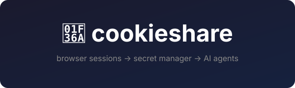

<p align="center">
  
</p>

<p align="center">
  <strong>Sync your browser sessions to Google Secret Manager.<br>Let your AI agents log into websites.</strong>
</p>

<p align="center">
  <a href="#how-it-works">How It Works</a> &bull;
  <a href="docs/gcp-setup.md">Setup Guide</a> &bull;
  <a href="#usage">Usage</a> &bull;
  <a href="#examples">Examples</a> &bull;
  <a href="#contributing">Contributing</a>
</p>

---

> [!CAUTION]
> **This project is vibe coded.** It was built by AI, for AI. The code works, but it has not been
> formally audited. You are trusting AI-written code to handle your browser session data — cookies,
> localStorage, auth tokens — and store them in Google Cloud.
>
> **Use at your own risk.** Read the code. Understand what it does. We are not responsible for
> anything that happens to your accounts, sessions, or data.
>
> **We welcome PRs.** If you see something sketchy, fix it. That's the deal.

---

## The Problem

You have an AI agent — Claude, GPT, a Playwright script, whatever — and you want it to do something
on a website where you're logged in. Maybe draft an email, check a dashboard, or scrape data from
behind a login wall.

But the agent can't log in as you. It doesn't have your cookies. It doesn't have your localStorage
tokens. And Chrome 146+ killed the old trick of attaching a debugger to your default profile.

**cookieshare bridges the gap.** It's a Chrome extension that watches your browser sessions and syncs
them to Google Secret Manager. Your scripts pull fresh cookies from there and use them directly.

```
Your Browser                    Google Secret Manager               Your Scripts
┌──────────┐    auto-sync      ┌──────────────────┐    pull        ┌──────────┐
│ Logged in │ ──────────────► │ cookie-share-     │ ◄──────────── │ Playwright│
│ to Gmail  │    (extension)   │ mail-google-com   │  (gcloud CLI) │ Agent     │
└──────────┘                   └──────────────────┘               └──────────┘
```

## How It Works

**cookieshare** has two parts:

### 1. Chrome Extension (the sender)

A Manifest V3 Chrome extension that:
- Watches cookies for domains you choose
- Collects localStorage and sessionStorage from open tabs
- Compresses everything with gzip (to fit Secret Manager's 64KB limit)
- Pushes to Google Secret Manager via OAuth

Syncs happen automatically when cookies change (debounced to 1 min) and on a periodic schedule
(default: every 15 min). You can also trigger manual syncs from the popup.

### 2. Consumer Script (the receiver)

A bash script (`scripts/pull-cookies.sh`) that fetches the latest session data from Secret Manager
and outputs JSON. Pipe it into Playwright, requests, curl, or whatever you want.

```bash
# Get full session data for a domain
./scripts/pull-cookies.sh github.com --project my-gcp-project

# Just the cookies
./scripts/pull-cookies.sh github.com --project my-gcp-project --cookies-only

# Pipe into jq
./scripts/pull-cookies.sh github.com --project my-gcp-project | jq '.localStorage'
```

## Architecture

```
┌─────────────────────────────────────────────────────────────┐
│                    Chrome Extension (MV3)                     │
│                                                              │
│  ┌──────────┐  ┌──────────┐  ┌────────────────────────────┐ │
│  │  Popup   │  │ Options  │  │    Background Service      │ │
│  │ "Sync    │  │  Page    │  │    Worker                  │ │
│  │  This    │  │          │  │                            │ │
│  │  Site"   │  │ • Domain │  │ • cookie.onChanged listener│ │
│  │          │  │   list   │  │ • Debounced sync (1 min)   │ │
│  │          │  │ • GCP    │  │ • Periodic sync (15 min)   │ │
│  │          │  │   config │  │ • OAuth via chrome.identity│ │
│  └──────────┘  └──────────┘  │ • gzip compression        │ │
│                              │ • Secret version cleanup   │ │
│                              └─────────────┬──────────────┘ │
└────────────────────────────────────────────┼────────────────┘
                                             │
                                             ▼
                              Google Secret Manager REST API
                              ┌──────────────────────────────┐
                              │ cookie-share-github-com       │
                              │ cookie-share-example-com      │
                              │ cookie-share-mail-google-com  │
                              │ ...                           │
                              └──────────────┬───────────────┘
                                             │
                                             ▼
                              ┌──────────────────────────────┐
                              │       Consumer Scripts        │
                              │                              │
                              │  pull-cookies.sh → JSON      │
                              │  Playwright scripts          │
                              │  Python automations          │
                              │  AI agents                   │
                              └──────────────────────────────┘
```

### Secret Format

Each domain gets one secret named `cookie-share-<domain-with-dashes>`:

| Domain | Secret Name |
|--------|-------------|
| `github.com` | `cookie-share-github-com` |
| `mail.google.com` | `cookie-share-mail-google-com` |

The secret value is compressed JSON:

```json
{
  "domain": "github.com",
  "timestamp": "2026-03-26T12:00:00Z",
  "cookies": [
    {
      "name": "_gh_sess",
      "value": "abc123...",
      "domain": ".github.com",
      "path": "/",
      "secure": true,
      "httpOnly": true,
      "expirationDate": 1753000000
    }
  ],
  "localStorage": {
    "theme": "dark",
    "user.login": "octocat"
  },
  "sessionStorage": {}
}
```

## Setup

**Prerequisites:**
- Chrome or Chromium-based browser
- A Google Cloud project with billing enabled
- `gcloud` CLI installed (for consumer scripts)

**Full setup guide with screenshots: [docs/gcp-setup.md](docs/gcp-setup.md)**

### Quick Version

1. Enable the Secret Manager API in your GCP project
2. Create an OAuth 2.0 Client ID (Web Application type)
3. Load the extension unpacked in Chrome, note the Extension ID
4. Set the OAuth redirect URI to `https://<your-extension-id>.chromiumapp.org/`
5. Paste your Client ID into `extension/manifest.json`
6. Open the extension's Options page and enter your GCP Project ID
7. Click "Sync This Site" on any page — done

## Usage

### Adding a Site

1. Navigate to the site you want to sync (make sure you're logged in)
2. Click the cookieshare extension icon
3. Click **Sync This Site**
4. Approve the host permission
5. Sign in with Google (first time only)

The extension now watches that domain. Cookies sync automatically.

### Managing Sites

Click **Manage Sites** in the popup (or right-click the extension → Options) to:
- See all watched domains and their sync status
- Trigger manual syncs
- Remove domains
- Change your GCP Project ID or sync interval

### Pulling Session Data

From any machine with `gcloud` auth:

```bash
# Full session data
./scripts/pull-cookies.sh example.com --project my-gcp-project

# Or set the env var so you don't have to pass --project every time
export COOKIESHARE_GCP_PROJECT="my-gcp-project"
./scripts/pull-cookies.sh example.com
```

## Examples

### Playwright: Log into a site using synced cookies

See [examples/playwright-login.js](examples/playwright-login.js) for a complete working example.

```javascript
const { chromium } = require('playwright');
const { execSync } = require('child_process');

// Pull fresh cookies from Secret Manager
const raw = execSync('scripts/pull-cookies.sh github.com --project my-gcp-project');
const session = JSON.parse(raw);

const browser = await chromium.launch();
const context = await browser.newContext();

// Inject cookies
await context.addCookies(session.cookies.map(c => ({
  name: c.name,
  value: c.value,
  domain: c.domain,
  path: c.path,
  secure: c.secure,
  httpOnly: c.httpOnly,
  expires: c.expirationDate || -1,
})));

const page = await context.newPage();
await page.goto('https://github.com');
// You're logged in!
```

### See Also

- **[model-router](https://github.com/mikeyla/model-router)** — An AI model routing system that uses
  cookieshare to pull browser sessions for usage tracking across multiple AI subscriptions.

## How It's Built

Pure JavaScript, no build step, no dependencies. The extension is ~500 lines of vanilla JS across
four files. The consumer script is 75 lines of bash.

| File | What it does |
|------|-------------|
| `extension/background.js` | Service worker: cookie watching, data collection, GSM sync |
| `extension/popup.js` | Two-click "Sync This Site" UI |
| `extension/options.js` | Domain management and settings panel |
| `scripts/pull-cookies.sh` | Fetch + decompress session data from GSM |

## Security Considerations

**Read this. Seriously.**

- This extension has access to your cookies and localStorage for any domain you add. That includes
  auth tokens, session IDs, and anything else stored in your browser.
- Session data is stored in Google Secret Manager, encrypted at rest by Google. But anyone with
  `secretmanager.versions.access` on your GCP project can read it.
- The OAuth scope is `cloud-platform` (broad). You could scope it down to just Secret Manager if
  you modify the manifest.
- The extension only sends data to `secretmanager.googleapis.com` — check the CSP in `manifest.json`.
- Old secret versions are automatically destroyed (keeps last 5 by default).

**Recommendations:**
- Only sync domains you actually need for automation
- Use a dedicated GCP project (not your production project)
- Restrict IAM access to the minimum set of users/service accounts
- Review the extension's permissions in `chrome://extensions`
- Audit the code — it's short enough to read in 15 minutes

## Contributing

This was vibe coded and there's plenty to improve. PRs welcome for:

- Security hardening
- Better error messages
- Additional consumer scripts (Python, Node, etc.)
- Tests (there are none, lol)
- Icons and visual polish
- Documentation improvements

Please keep the extension dependency-free. No build steps, no npm, no webpack. It's simple and it
should stay that way.

## License

[MIT](LICENSE)
